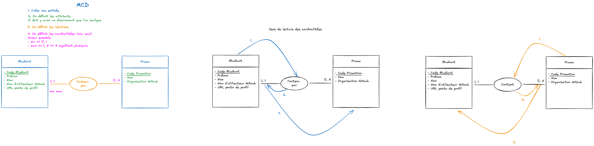

# MLD

Modèle Logique de Données.

L'idée est de transformer le MCD en MLD.

## Règles de transformation

- Une entité devient une table
- Les relations vont se matérialiser par des clées étrangères
  - Si la relation à une cardinalité max de 1, on met la clé étrangère contenant l'id de la table opposé dans la table de l'entité qui a la cardinalité max de 1
  - Si la relation à une cardinalité max de N de chaque côté, on va créer une table de jointure. Cette table permettra de faire le lien entre les deux données

## Pour notre projet

promo (
  id
  github_organization
  name
)

student (
  id
  first_name
  last_name
  github_username
  profile_picture_url
  <!-- Pour symboliser les clées étrangère, je rajoute un # devant -->
  <!-- Ici c'est l'application de la règle numéro deux -->
  <!-- La clé étrangère aura comme valeur l'identifiant de la table opposée -->
  #promo_id
)
